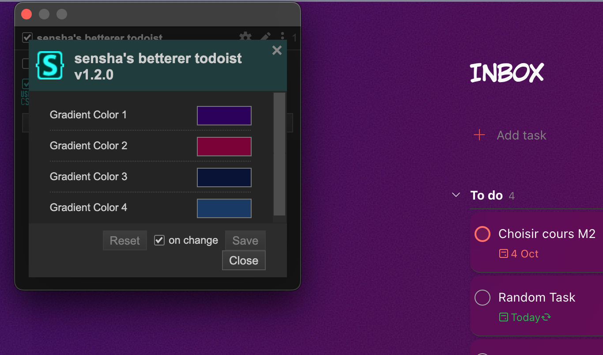

# sensha-betterer-todoist

This is the first in a - hopefully short - series of ""design"" projects. 

## Visuals 

Betterer mostly means pretty. The automatically sliding sidebar is very cool though because you gain a ton of space. 

If you do not like the gradient or you are like me and you like changing colors all the time, you can change the colors directly through Stylus' UI. It's pretty neat and instantaneous. 

### Installation 

You should use the Dark Theme in Todoist - so all the letters go white and not black. 

If you have a mac and are using ArcBrowser, then only use whatever is in the ArcBoost folder and copy/paste the CSS and js scripts in the relevant space, it will **just work**. 

If you do not, go through the other two folders and follow these instead: 

Install the css using Stylus

-   [Firefox](https://addons.mozilla.org/en-US/firefox/addon/styl-us/)
-   [Chrome](https://chromewebstore.google.com/detail/stylus/clngdbkpkpeebahjckkjfobafhncgmne)

Once you have Stylus, you can install it directly clicking here: 

Install the js script using whatever people use to manage userscripts. I used [ViolentMonkey](https://violentmonkey.github.io/) because that's what Fallen used. Can be done by clicking here: 

### Credits 

[Fallen](https://github.com/FallenStar08) - I credit you as much as I blame you for this. 

Nins - I am sorry you are jealous of my newfound frontend skills. 

